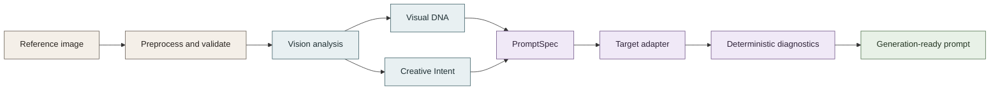
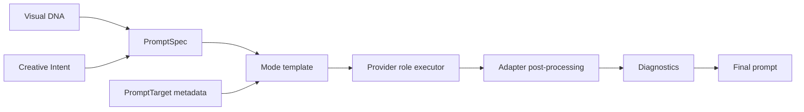

# ImPrompt

**Image-to-prompt visual reverse engineering.**

ImPrompt turns a reference image into a structured visual representation and then into a generation-ready prompt for a selected image model. It preserves the visual facts that affect reconstruction: subjects, human geometry, relationships, composition, lighting, color, materials, environment, uncertainty, and—when the input is a moodboard—panel variation and series continuity.

This is not image captioning. Captioning asks *“What is visible?”* ImPrompt asks *“What visual information needs to survive so another model can reproduce the result?”*

## At a glance



Detailed diagrams:

- [Core pipeline](docs/diagrams/core-pipeline.md)
- [Human and multi-person analysis](docs/diagrams/human-analysis.md)
- [Collage and moodboard analysis](docs/diagrams/collage-analysis.md)
- [Prompt construction and adapters](docs/diagrams/prompt-construction.md)
- [System architecture](docs/diagrams/system-architecture.md)

## What the pipeline does

1. **Preprocesses the reference.** Uploaded data is checked using image signatures, decoded pixel limits, byte limits, EXIF orientation, transparency handling, and normalized JPEG output. Public URLs go through scheme, DNS/IP, redirect, content-type, streaming-size, and image validation.
2. **Runs vision analysis.** One vision call returns Visual DNA, Creative Intent input, and optional collage analysis. The response is parsed and validated inside the provider retry boundary.
3. **Builds typed artifacts.** Pydantic models normalize omissions and preserve explicit uncertainty instead of filling gaps with invented facts.
4. **Constructs a prompt.** `PromptSpec` combines Visual DNA and Creative Intent with an editable mode template, prioritizing visual constraints over decorative adjectives.
5. **Adapts to the target.** A `PromptTarget` supplies model-specific guidance, syntax, limits, negative-prompt behavior, and deterministic post-processing.
6. **Scores the result.** Diagnostics run without another AI call. They check filler, unsupported camera claims, repetition, contradictions, model suitability, and visual coverage—including human-pose coverage.

Supported modes are `recreate`, `create_similar`, `extract_style`, `extract_composition`, `extract_lighting`, `extract_color`, `extract_pose`, and `modify`.

## Visual DNA

Visual DNA is the observation layer between an image and a prompt. It currently contains:

- **Subjects:** appearance, clothing, accessories, distinguishing characteristics, pose, frame position, scale, depth, and confidence.
- **Human geometry:** body state; torso, shoulder, hip, head, and face orientation; stance; weight distribution; leg and foot position when visible; gaze direction and target; left/right arm and hand placement; gestures; contact; visible and occluded body regions.
- **Relationships:** explicit subject-to-subject relations such as front/behind, facing, holding, touching, depth order, distance, contact points, and occlusion.
- **Scene structure:** foreground, midground, background, location, atmosphere, composition, framing, negative space, perspective, and depth.
- **Rendering characteristics:** camera appearance categories, lighting direction and quality, fill/rim behavior, palette and grading, materials, style, mood, typography, and essential/supporting/incidental elements.
- **Evidence state:** section confidence, element importance, uncertainty notes, and observed-versus-interpreted separation.

The human fields are deliberately separate. Body orientation is not gaze; head direction is not eye direction; touch is not emotion. Cropped or hidden anatomy remains unavailable rather than being guessed.

## Human and multi-person analysis

For each visible person, the vision prompt performs an individual structure pass before a pairwise relationship pass. That makes a distinction such as this representable:

> The woman occupies the foreground with her torso three-quarter toward the camera and her head turned toward the man. The man is behind her, his arm around her waist; her hand rests over his forearm. Their bodies overlap and the lower body is not visible.

The wording is generated from observations, not from a fixed couple template. If a hand, foot, or gaze is hidden or ambiguous, the analysis can record it as occluded, cropped, not visible, or uncertain.

See the [human analysis workflow](docs/diagrams/human-analysis.md).

## Moodboards and collages

Structural references are not flattened into one scene. Vision analysis can produce:

- `PanelRecord` entries with index, title, bounds, summary, and a `ShotRecord`
- `GlobalCreativeDNA` for recurring palette, lighting, wardrobe, environment, style, motifs, and composition patterns
- a master creative direction for the shared series
- one complete, shot-specific prompt per usable panel

Continuity belongs in the master direction: same subjects, wardrobe family, location family, palette, lighting language, and editorial tone. Variation belongs in each shot: framing, pose, gaze, orientation, interaction, viewpoint, scale, and environment emphasis.

## Prompt construction and adapters

The universal representation is kept separate from model syntax:



The registry currently exposes these target adapters:

| Target | Prompt style | Negative prompt | Special handling |
|---|---|---|---|
| Generic | Natural-language paragraph | Supported | No model-specific assumptions |
| Gemini (Nano Banana) | Conversational, literal prose | Not separate | Supports reference-relative image editing language |
| GPT Image (OpenAI) | Detailed literal prose | Not separate | Supports reference-relative editing language |
| FLUX | Flowing descriptive prose | Supported by many UIs | No parameter flags or quality-word spam |
| Midjourney | Dense comma-separated phrases | Inline `--no` only | Appends `--ar` from analyzed aspect ratio |
| Stable Diffusion | Ordered comma-separated tags | Supported and expected | Optional sparse emphasis syntax |

These are prompt adapters, not image-generation integrations. The backend currently wraps Gemini and OpenAI as AI providers for vision and text stages; target adapters describe the output format requested from those stages.

## System architecture

The repository-level architecture is documented in the [system architecture diagram](docs/diagrams/system-architecture.md). The application is a local, single-process system: there is no database, queue, or distributed worker layer.

## Quick start

Requirements: Python 3.12+, [uv](https://docs.astral.sh/uv/), and Node.js 18+.

```bash
cd backend
uv sync
cp .env.example .env
# Set GEMINI_API_KEY and OPENAI_API_KEY in backend/.env as needed.

cd ../frontend
npm install
```

Start the backend in one terminal:

```bash
cd backend
uv run uvicorn app.main:app --reload --port 8000
```

Start the Vite frontend in another:

```bash
cd frontend
npm run dev
```

The frontend runs at `http://localhost:5173` and proxies `/api` to `http://localhost:8000`. The backend also serves `frontend/dist` when that directory exists. To use another backend port, set `VITE_DEV_PROXY_TARGET` in `frontend/.env`; see [`frontend/.env.example`](frontend/.env.example).

Provider selection, model names, fallback behavior, image limits, CORS, and timeouts are configured in [`backend/app/config.py`](backend/app/config.py) and [`backend/.env.example`](backend/.env.example).

## API

Every response uses the envelope `{"success": ..., "data": ..., "error": ...}`. Errors include a request ID.

### Analysis and media

| Method | Route | Purpose |
|---|---|---|
| `POST` | `/api/analyze` | Validate an image, run visual analysis, and optionally generate a prompt |
| `POST` | `/api/fetch-image` | Fetch and normalize a public reference image URL with SSRF protections |

### Prompting and diagnostics

| Method | Route | Purpose |
|---|---|---|
| `POST` | `/api/generate-prompt` | Generate a prompt from submitted Visual DNA and optional Creative Intent |
| `POST` | `/api/refine-prompt` | Reconstruct a complete prompt while applying a surgical instruction |
| `POST` | `/api/validate-prompt` | Run deterministic quality and coverage diagnostics; no AI call |

### System

| Method | Route | Purpose |
|---|---|---|
| `GET` | `/api/models` | List registered target adapters and their capabilities |
| `GET` | `/api/health` | Report version, configured/available providers, and fallback status |

Route implementations live in [`backend/app/api/`](backend/app/api/).

## Project structure

```text
backend/
  app/
    api/                 FastAPI routes and request orchestration
    analysis/            Image-to-artifact vision stage and cache keying
    models/              Visual DNA, intent, collage, quality, and API contracts
    prompting/           PromptSpec, optimizer, diagnostics, and adapters
    providers/           Gemini/OpenAI wrappers and retry/fallback executor
    services/            TTL cache and stage/request observability
    utils/               Image normalization, URL fetching, JSON utilities, errors
    prompts/             Editable vision and prompt-generation templates
  tests/                 Hermetic backend tests and optional live tests
frontend/
  src/
    components/          Reference, DNA, prompt, quality, history, and shot UI
    hooks/               Analysis state and API workflow
    services/            HTTP API and frontend error handling
    utils/               History, image, filename, sanitization, and theme helpers
docs/
  diagrams/              Source-controlled Mermaid documentation diagrams
```

## Reliability and security boundaries

Implemented safeguards include:

- image magic-byte and decoded-format validation
- compressed-byte, decoded-pixel, and normalized-side limits
- EXIF orientation and transparent-image normalization
- public HTTP(S)-only URL fetching with DNS/IP checks and redirect validation
- streamed URL downloads with content-length and byte-budget checks
- typed response validation inside provider retry/fallback boundaries
- deterministic primary/fallback attempt budgets
- versioned in-process TTL analysis cache and concurrent in-flight deduplication
- strict API envelopes, bounded request payloads, and request IDs
- deterministic prompt diagnostics, including unsupported technical camera claims

The service has no authentication or rate limiting and is intended as a localhost tool. URL fetching still has a documented DNS-rebinding TOCTOU window, and the cache is process-local.

## Testing and verification

Backend hermetic tests use mocked providers and do not require API credits:

```bash
cd backend
uv run pytest tests
uv run ruff check app tests
```

Optional provider-backed tests:

```bash
cd backend
RUN_LIVE_TESTS=1 uv run pytest tests/test_live.py
```

Frontend checks:

```bash
cd frontend
npm run lint
npm run typecheck
npm test
npm run build
```

The same backend and frontend checks run in [GitHub Actions](.github/workflows/ci.yml).

## Design principles

- Observe before interpreting.
- Preserve structured visual facts and uncertainty.
- Keep human geometry separate from mood.
- Keep collage-wide continuity separate from shot-specific variation.
- Build one model-independent PromptSpec, then adapt it to the target.
- Prefer information density over decorative verbosity.
- Never invent unsupported camera metadata or hidden anatomy.
- Keep diagnostics deterministic and explainable.

## Roadmap

### Current

The repository contains the complete image-to-prompt flow, typed Visual DNA, human and relationship analysis, collage handling, target adapters, deterministic diagnostics, refinement, caching, provider fallback, and local React UI.

### Next

The most valuable engineering follow-ups are broader real-image evaluation fixtures for human geometry and richer diagnostics for panel-level master directions.

### Future deployment work

If ImPrompt is exposed beyond localhost, authentication, rate limiting, distributed cache coordination, and a stronger URL-fetch transport boundary should be added before treating it as a public service.

## License

No license file is currently present in the repository. Add an explicit license before distributing ImPrompt as an open-source package.
