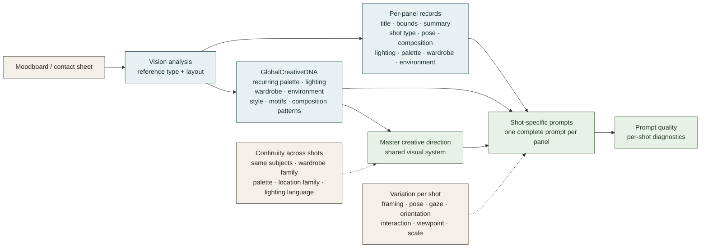

# Collage and moodboard analysis

Collage handling is produced by the same vision analysis call, but the resulting `CollageAnalysis` preserves panel-specific shot records alongside global creative DNA.

