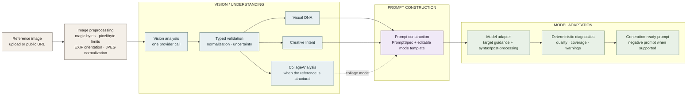

# Core visual reverse-engineering pipeline

This diagram follows the actual `/api/analyze` path. Vision produces typed artifacts; prompt construction and model adaptation are separate stages.

```mermaid
flowchart LR
    A["Reference image<br/>upload or public URL"]
    B["Image preprocessing<br/>magic bytes · pixel/byte limits<br/>EXIF orientation · JPEG normalization"]
    C["Vision analysis<br/>one provider call"]
    D["Typed validation<br/>normalization · uncertainty"]
    E["Visual DNA"]
    F["Creative Intent"]
    G["CollageAnalysis<br/>when the reference is structural"]
    H["Prompt construction<br/>PromptSpec + editable mode template"]
    I["Model adapter<br/>target guidance + syntax/post-processing"]
    J["Deterministic diagnostics<br/>quality · coverage · warnings"]
    K["Generation-ready prompt<br/>negative prompt when supported"]

    A --> B --> C --> D
    D --> E
    D --> F
    D --> G
    E --> H
    F --> H
    G -. "collage mode" .-> H
    H --> I --> J --> K

    subgraph UNDERSTANDING["VISION / UNDERSTANDING"]
      C
      D
      E
      F
      G
    end
    subgraph CONSTRUCTION["PROMPT CONSTRUCTION"]
      H
    end
    subgraph ADAPTATION["MODEL ADAPTATION"]
      I
      J
      K
    end

    classDef input fill:#f4efe8,stroke:#6b6258,color:#28231f
    classDef understanding fill:#e8f0f2,stroke:#42636b,color:#1f3034
    classDef construction fill:#f0e9f7,stroke:#725789,color:#30243a
    classDef output fill:#e8f1e7,stroke:#557653,color:#253724
    class A,B input
    class C,D,E,F,G understanding
    class H construction
    class I,J,K output
```
