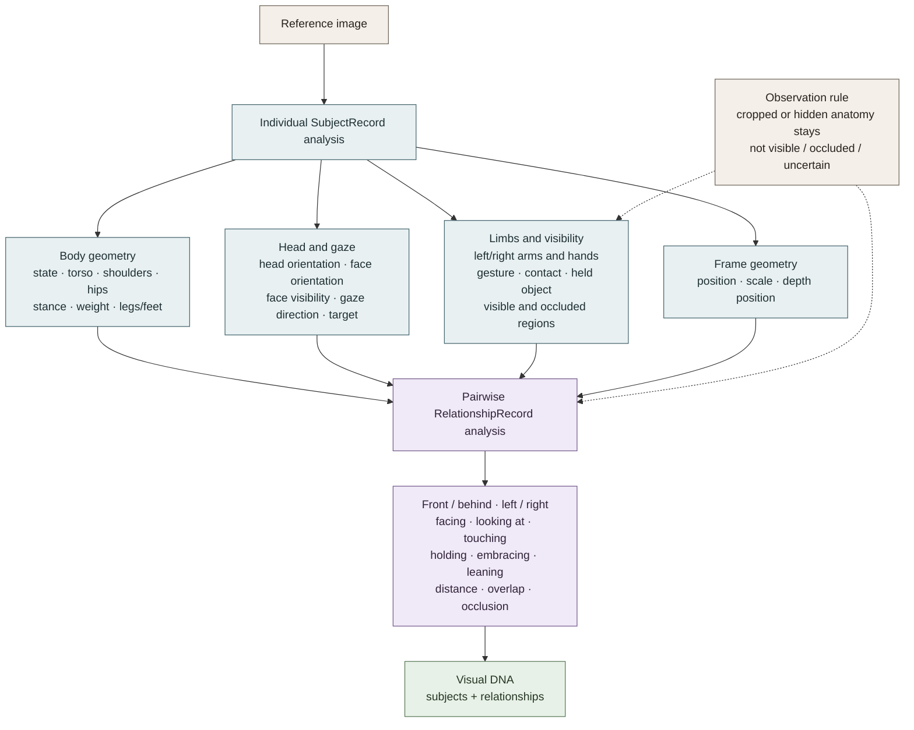

# Human and multi-person analysis

Human analysis is represented as observable geometry. The schema keeps individual subject facts separate from pairwise `RelationshipRecord` facts.

```mermaid
flowchart TB
    A["Reference image"]
    B["Individual SubjectRecord analysis"]
    C["Body geometry<br/>state · torso · shoulders · hips<br/>stance · weight · legs/feet"]
    D["Head and gaze<br/>head orientation · face orientation<br/>face visibility · gaze direction · target"]
    E["Limbs and visibility<br/>left/right arms and hands<br/>gesture · contact · held object<br/>visible and occluded regions"]
    F["Frame geometry<br/>position · scale · depth position"]
    G["Pairwise RelationshipRecord analysis"]
    H["Front / behind · left / right<br/>facing · looking at · touching<br/>holding · embracing · leaning<br/>distance · overlap · occlusion"]
    I["Visual DNA<br/>subjects + relationships"]

    A --> B
    B --> C
    B --> D
    B --> E
    B --> F
    C --> G
    D --> G
    E --> G
    F --> G
    G --> H --> I

    N["Observation rule<br/>cropped or hidden anatomy stays<br/>not visible / occluded / uncertain"]
    N -.-> E
    N -.-> G

    classDef image fill:#f4efe8,stroke:#6b6258,color:#28231f
    classDef subject fill:#e8f0f2,stroke:#42636b,color:#1f3034
    classDef relation fill:#f0e9f7,stroke:#725789,color:#30243a
    classDef result fill:#e8f1e7,stroke:#557653,color:#253724
    class A image
    class B,C,D,E,F subject
    class G,H relation
    class I result
    class N image
```
