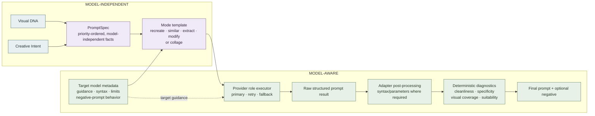

# Prompt construction and model adapters

The universal visual representation is assembled before target-specific formatting is applied.

```mermaid
flowchart LR
    A["Visual DNA"]
    B["Creative Intent"]
    C["PromptSpec<br/>priority-ordered, model-independent facts"]
    D["Mode template<br/>recreate · similar · extract · modify<br/>or collage"]
    E["Target model metadata<br/>guidance · syntax · limits<br/>negative-prompt behavior"]
    F["Provider role executor<br/>primary · retry · fallback"]
    G["Raw structured prompt result"]
    H["Adapter post-processing<br/>syntax/parameters where required"]
    I["Deterministic diagnostics<br/>cleanliness · specificity<br/>visual coverage · suitability"]
    J["Final prompt + optional negative"]

    A --> C
    B --> C
    C --> D
    E --> D
    D --> F --> G --> H --> I --> J
    E -. "target guidance" .-> F

    subgraph UNIVERSAL["MODEL-INDEPENDENT"]
      A
      B
      C
      D
    end
    subgraph TARGET["MODEL-AWARE"]
      E
      F
      G
      H
      I
      J
    end

    classDef source fill:#e8f0f2,stroke:#42636b,color:#1f3034
    classDef universal fill:#f0e9f7,stroke:#725789,color:#30243a
    classDef target fill:#e8f1e7,stroke:#557653,color:#253724
    class A,B source
    class C,D universal
    class E,F,G,H,I,J target
```
