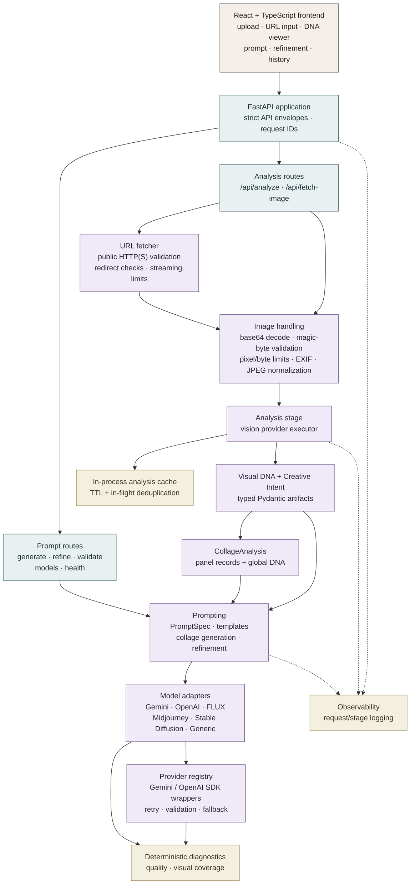

# ImPrompt system architecture

This is the repository-level view: the frontend calls the FastAPI routes, while the backend coordinates image handling, analysis, prompting, providers, and deterministic safeguards.

